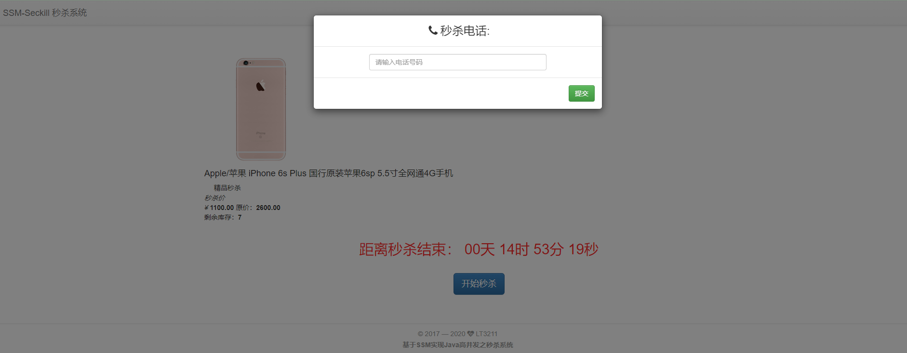

# SSM-seckill

> 学习了[慕课网](https://www.imooc.com/u/2145618/courses?sort=publish)上的一个视频，写的一个秒杀系统的demo,虽然只是对秒杀系统设计的管中窥豹，但项目中编码规范、异常处理以及部分优化思想还是值得学习。

### 技术点

1. 后端框架:SSM、Druid
2. 数据存储\缓存:Mysql、Redis
3. 前端: thymeleaf、Bootstrap、JQuery

### 部署

> [线上演示地址](http://47.115.43.39/SSM_seckill_war/seckill/list) 

#### 步骤

1. 本地或远程开启一个redis服务，修改配置文件中redis信息
2. mysql导入提供的sql文件，修改配置文件中数据库文件
3. 安装tomcat，把war包放入webapps目录
4. 安装nginx代理tomcat
5. 访问`主机名+端口+项目名+/seckill`

#### 项目截图

